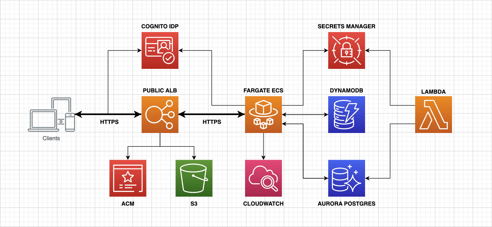
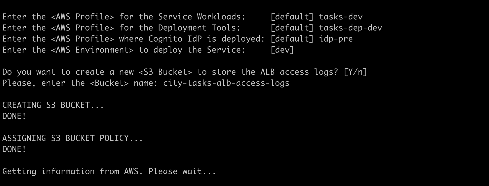
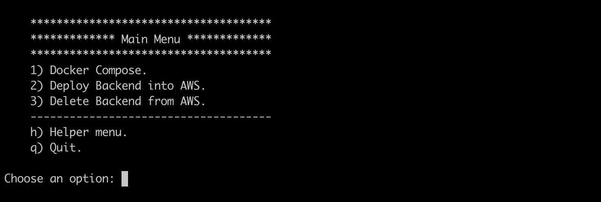
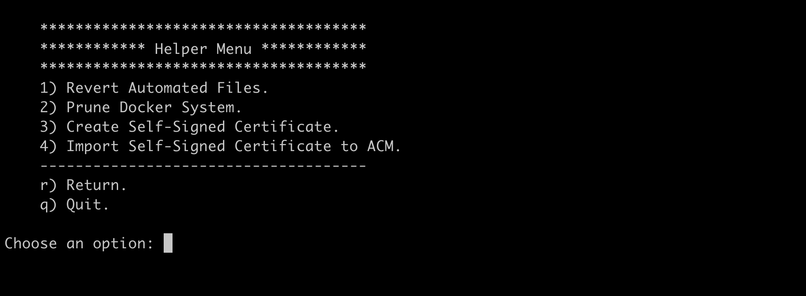

## Spring Boot Native/Reactive Microservice with End-to-End Encryption on ECS Fargate using AWS Copilot CLI.

* **Author**: [Andres Solorzano](https://www.linkedin.com/in/aosolorzano/).
* **Level**: Advanced.
* **Technologies**: Java 17, Spring Boot 3, Spring Native, Spring WebFlux, Spring OAuth2, Quartz, Flyway, AWS Copilot CLI, Testcontainers, Aurora Postgres, DynamoDB, Elastic Load Balancer (ELB), and Docker.



You can read the following sequence of articles to get more context:

1. [Multi-Account environment on AWS using IAM Identity Center](https://aosolorzano.medium.com/implementing-a-multi-account-environment-with-aws-organizations-and-the-iam-identity-center-d1cdb40bdf4d).
2. [OAuth2 in Spring Boot Native microservice](https://aosolorzano.medium.com/oauth2-in-spring-boot-native-reactive-microservice-with-amazon-cognito-as-oidc-service-c454d84a5234).
3. [Deploying Spring Boot Native microservice using Cross-Account deployment](https://aosolorzano.medium.com/spring-boot-native-microservice-on-ecs-fargate-using-aws-copilot-cli-for-cross-account-deployment-73b1836f21f7).
4. [Securing HTTP communications using Amazon Certificate Manager (ACM) and ALB](https://aosolorzano.medium.com/securing-http-communication-over-an-alb-using-acm-and-copilot-cli-in-a-multi-account-environment-954de1b89e54).
5. [End-to-End Encryption using TLS ECDSA certificate and ACM with Copilot CLI](https://aosolorzano.medium.com/end-to-end-encryption-using-tls-ecdsa-certificate-acm-and-aws-copilot-cli-64f5daafe977).

## Description.
This project uses the Spring Boot Framework to manage Quartz Jobs in a Spring Native microservice with the use of reactive programing using Spring WebFlux.
The Quartz library is configured for clustered environments, so its needs the help of Postgres database to manage the cron Jobs execution. 
When a Job is executed, the calling method retrieves the Device item from DynamoDB to change its state. 
To perform these activities, the users must be logged into the OIDC Service that its deployed using the AWS Cognito service.
All test cases using the TDD methodology from the beginning of the development phase, and only Integration Tests are executed with the support of Testcontainers because Unit Testing does not cover real world scenarios.
This project also uses Docker Compose to deploy a local cluster alongside the other required services by the Spring Boot application.

## Generating TLS self-signed certificate.
Go to the `utils/certs` directory and execute the following:
```
openssl req -x509               \
  -newkey rsa:4096              \
  -days   365                   \
  -keyout server-key.pem        \
  -out    server-crt.pem
```
The OpenSSL command creates 2 files: the certificate and its private key.
Modify the `utils/docker/envoy/envoy.yaml` file replacing your server domain name instead the keyword `server_fqdn`. 
Now, you're ready to launch the Tasks Server microservice.

## Running Locally with Docker Compose.
Execute the following command to get your Cognito User Pool ID:
```
aws cognito-idp list-user-pools --max-results 10
```
Then, modify the `utils/docker/compose/tasks-api-dev.env` file and replace the `<cognito_user_pool_id>` with the corresponding one.

Now, you can execute the following command from the project's root directory to deploy the Docker cluster locally:
```
docker compose up --build
```

### Getting Device items from DynamoDB on LocalStack.
Execute the following command:
```
aws dynamodb scan                           \
  --table-name Devices                      \
  --endpoint-url http://localhost:4566
```

## Running Locally using Native Executable.
Use this option if you want to explore more features such as running your tests in a native image.
*IMPORTANT:* The GraalVM `native-image` compiler should be installed and configured on your machine.

Deploy the required services using Docker Compose command:
```
docker compose up tasks-postgres tasks-localstack
```

Open a new terminal window and export the following environment variables:
```
export SPRING_PROFILES_ACTIVE=dev
export CITY_TASKS_DB_CLUSTER_SECRET='{"dbClusterIdentifier":"city-tasks-db-cluster","password":"postgres123","dbname":"CityTasksDB","engine":"postgres","port":5432,"host":"localhost","username":"postgres"}'
export CITY_IDP_ENDPOINT='https://cognito-idp.<your_cognito_region>.amazonaws.com/<your_cognito_user_pool_id>'
export CITY_TASKS_TIME_ZONE='-05:00'
export AWS_DEFAULT_REGION='ap-southeast-2'
export AWS_ACCESS_KEY_ID='DUMMY'
export AWS_SECRET_ACCESS_KEY='DUMMY'
export AWS_ENDPOINT_OVERRIDE='http://localhost:4566'
```

Then, create and run the native executable from the project's root directory:
```
$ ./mvnw clean native:compile -Pnative spring-boot:run
```

## Deploying into AWS - Bash Scripts.
Use the following script to deploy the application into AWS:
```
./run-scripts.sh
```
the script will ask you for the required AWS profiles to deploy the application into AWS:



Then, the script shows a main menu with the following options:



Choose option 1 to deploy the application into AWS.

Also, you have a Helper Menu to perform other activities as prerequisites for the application deployment:



### AWS Copilot CLI - Helpful Commands.
List all of your AWS Copilot applications.
```
copilot app ls
```
Show information about the environments and services in your application.
```
copilot app show
```
Show information about your environments.
```
copilot env ls
```
List of all the services in an application.
```
copilot svc ls
```
Show service status.
```
copilot svc status
```
Show information about the service, including endpoints, capacity and related resources.
```
copilot svc show
```
Show logs of a deployed service.
```
copilot svc logs        \
    --app city-tasks    \
    --name api          \
    --env dev           \
    --since 1h          \
    --follow
```
Start an interactive bash session with a task part of the service:
```
copilot svc exec        \
    --app city-tasks    \
    --name api          \
    --env dev
```
To delete and clean-up all created resources.
```
copilot app delete --yes
```


## Spring Boot - Reference Documentation.
For further reference, please consider the following sections:

* [Official Apache Maven documentation](https://maven.apache.org/guides/index.html)
* [Spring Boot Maven Plugin Reference Guide](https://docs.spring.io/spring-boot/docs/3.1.0/maven-plugin/reference/html/)
* [Create an OCI image](https://docs.spring.io/spring-boot/docs/3.1.0/maven-plugin/reference/html/#build-image)
* [GraalVM Native Image Support](https://docs.spring.io/spring-boot/docs/3.1.0/reference/html/native-image.html#native-image)
* [Testcontainers](https://www.testcontainers.org/)
* [Testcontainers Postgres Module Reference Guide](https://www.testcontainers.org/modules/databases/postgres/)
* [Spring Reactive Web](https://docs.spring.io/spring-boot/docs/3.1.0/reference/htmlsingle/#web.reactive)
* [Spring Data JPA](https://docs.spring.io/spring-boot/docs/3.1.0/reference/htmlsingle/#data.sql.jpa-and-spring-data)
* [OAuth2 Resource Server](https://docs.spring.io/spring-security/reference/reactive/oauth2/resource-server/)
* [Quartz Scheduler](https://docs.spring.io/spring-boot/docs/3.1.0/reference/htmlsingle/#io.quartz)
* [Flyway Migration](https://docs.spring.io/spring-boot/docs/3.1.0/reference/htmlsingle/#howto.data-initialization.migration-tool.flyway)

### Guides
The following guides illustrate how to use some features concretely:

* [Building a Reactive RESTful Web Service](https://spring.io/guides/gs/reactive-rest-service/)
* [Validation](https://spring.io/guides/gs/validating-form-input/)
* [Accessing Data with JPA](https://spring.io/guides/gs/accessing-data-jpa/)

### Additional Links
These additional references should also help you:

* [Configure AOT settings in Build Plugin](https://docs.spring.io/spring-boot/docs/3.1.0/maven-plugin/reference/htmlsingle/#aot)


## GraalVM Native Support
This project has been configured to let you generate either a lightweight container or a native executable.
It is also possible to run your tests in a native image.

### Lightweight Container with Cloud Native Buildpacks
If you're already familiar with Spring Boot container images support, this is the easiest way to get started.
Docker should be installed and configured on your machine prior to creating the image.

To create the image, run the following goal:

```
$ ./mvnw spring-boot:build-image -Pnative -DskipTests
```

Then, you can run the app like any other container:

```
$ docker run --rm city-tasks-api:1.6.0
```

### Executable with Native Build Tools
Use this option if you want to explore more options such as running your tests in a native image.
The GraalVM `native-image` compiler should be installed and configured on your machine.

**NOTE:** GraalVM 22.3+ is required.

To create the executable, run the following goal:

```
$ ./mvnw native:compile -Pnative -DskipTests
```

Then, you can run the app as follows:
```
$ target/city-tasks-spring-boot-aws-copilot
```

You can also run your existing tests suite in a native image.
This is an efficient way to validate the compatibility of your application.

To run your existing tests in a native image, run the following goal:

```
$ ./mvnw test -PnativeTest
```
